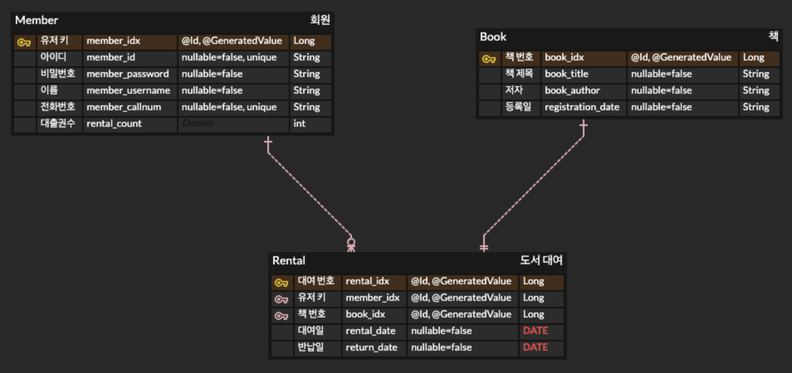

## 🙋‍♂️ 프로젝트 간단 소개
> 스프링부트를 이용하여 도서 관리 시스템 서버를 구축해보았습니다.

## 🛠 사용된 기술
- 자바 버전 : Java 11
- 컴파일러 : Gradle(v2.5.6)
- IDE : IntelliJ IDEA
- 프레임 워크 : Spring Boot
- 데이터 베이스 : H2 Database
- 사용된 기술 : Spring DataJPA, QueryDSL, Spring Security, Swagger, Lombok, Redis, Jwt etc..

## 🗺 ERD

## 📚 구현된 기능
> 회원
- 회원가입
- 로그인
- 비밀번호 변경
- 로그아웃

> 도서 관리
- 도서 목록에 도서 추가
- 도서 목록 전체 조회
- 도서 목록 단일 조회
- 등록된 도서 정보 수정
- 등록된 도서 삭제

> 도서 대출
- 도서 대출
- 도서 반납
- 도서 반납일 연장
- 도서 대출 목록 전체 조회
- 도서 대출 목록 단일 조회

> 기타 기능
- 상태에따른 Response 값을 반환 하게하는 Response 서비스 개발
- Custom Exception 개발